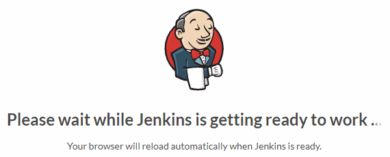
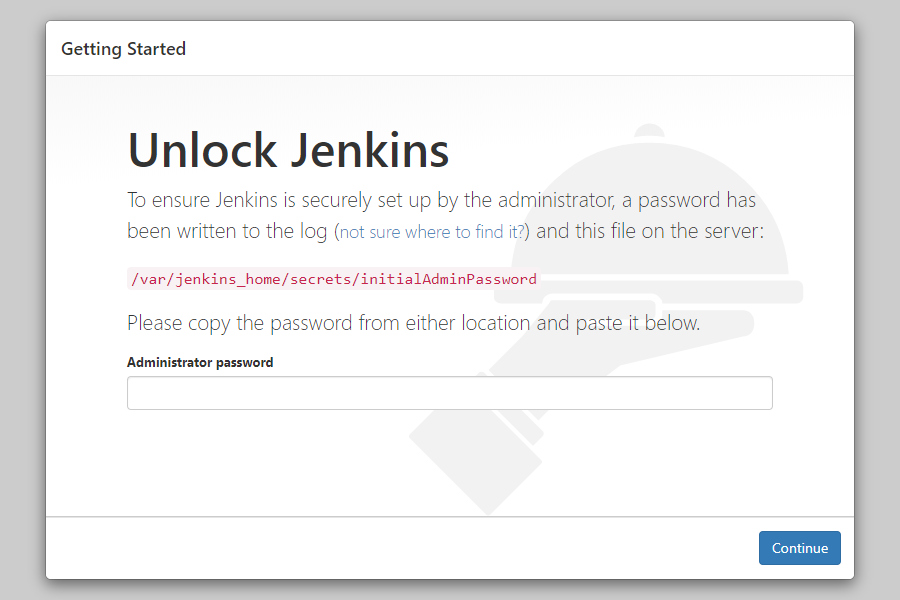
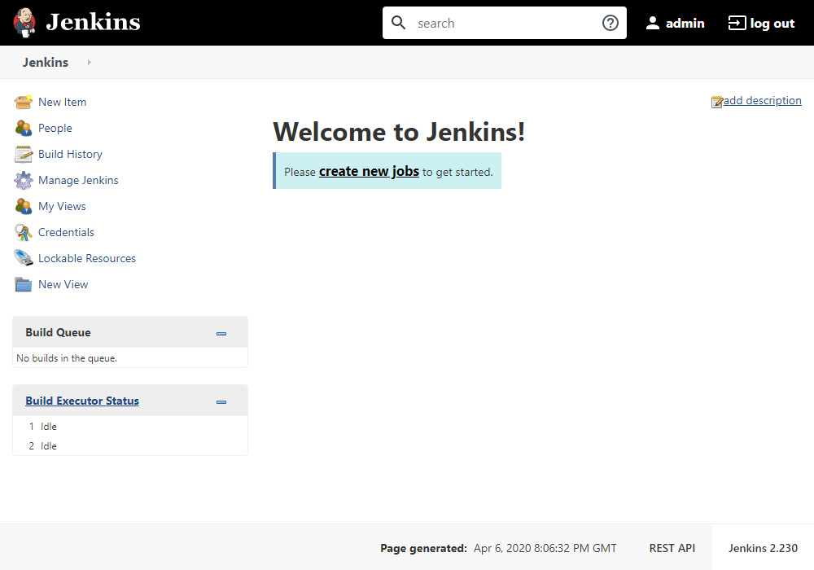

# Run Jenkins on Azure Container Instances

With this guideline, you can deploy and run [Jenkins](https://jenkins.io/) on [Azure ☁ Container Instances](https://azure.microsoft.com/en-us/services/container-instances/).

## Jenkins

[Jenkins](https://jenkins.io/) is one of the most popular open-source _DevOps_ tools and it has been widely adopted by many development projects as leading _CI engine_.

_Jenkins Documentation_ can be found on [Jenkins User Documentation](https://jenkins.io/doc/) page.

## Fun Facts about Jenkins

* Jenkins is a cross-platform Continuous Integration tool that builds and test software projects continuously.

* Jenkins is developed in Java programming languages that provide real-time testing and reporting.

* Jenkins provides hundreds of plugins to support building, deploying and automating any project.

* Jenkins makes easy for the developer to integrate changes to the projects.

* Jenkins has both GUI interface and console commands.

* Jenkins is an open-source CI tool completely compiled and written in Java that originated as a subsidiary of Oracle created by Sun Microsystems.

## Installing Jenkins on an existing Ubuntu machine

* Make sure that system has [Java JDK](https://openjdk.java.net/install/) on it

```bash
$ sudo apt update
$ sudo apt install openjdk-8-jdk
```

* Add Jenkins Repository

```bash
wget -q -O - https://pkg.jenkins.io/debian/jenkins.io.key | sudo apt-key add –
sudo sh -c 'echo deb http://pkg.jenkins.io/debian-stable binary/ > /etc/apt/sources.list.d/jenkins.list'
sudo apt update
```

* Install Jenkins

```bash
sudo apt install jenkins
```

Jenkins will run on [http://localhost:8080](http://localhost:8080)



After few seconds, Jenkins will be redirected to _Getting Started_ page and wait for user to enter initial administrator password.



After unlocking Jenkins, it requires to select plugin set to install. Jenkins can be installed with pre-defined set of plugins, or, you can select which plugins you want to install with Jenkins.

Installation usually take couple of minutes.


After installation done, Jenkins will redirect to _Main Page_

Boom! 💣 It's done!

You can use Jenkins, now 🎉



