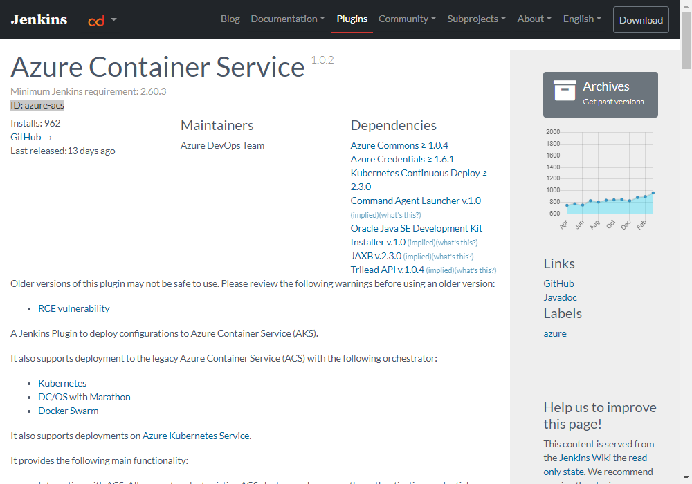
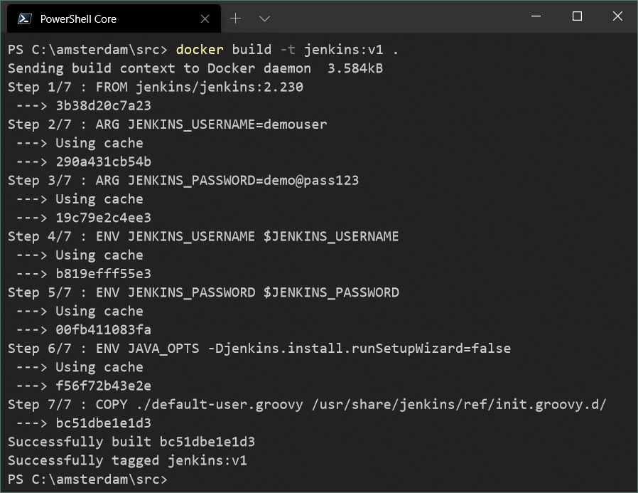
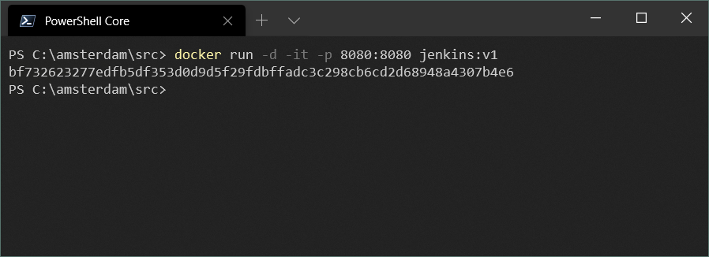
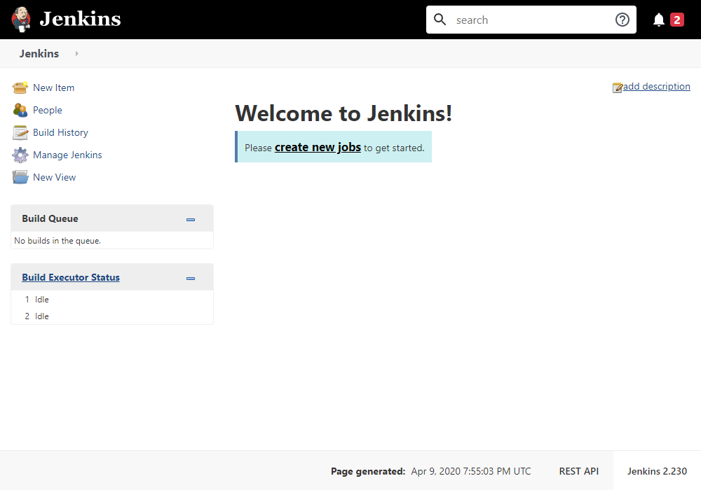

# Run Jenkins on Azure Container Instances

With this guideline, you can deploy and run [Jenkins](https://jenkins.io/) on [Azure ☁ Container Instances](https://azure.microsoft.com/en-us/services/container-instances/).

## Jenkins

[Jenkins](https://jenkins.io/) is one of the most popular open-source _DevOps_ tools and it has been widely adopted by many development projects as leading _CI engine_.

_Jenkins Documentation_ can be found on [Jenkins User Documentation](https://jenkins.io/doc/) page.

## Fun Facts about Jenkins

* Jenkins is a cross-platform Continuous Integration tool that builds and test software projects continuously.

* Jenkins is developed in Java programming languages that provide real-time testing and reporting.

* Jenkins provides hundreds of plugins to support building, deploying and automating any project.

* Jenkins makes easy for the developer to integrate changes to the projects.

* Jenkins has both GUI interface and console commands.

* Jenkins is an open-source CI tool completely compiled and written in Java that originated as a subsidiary of Oracle created by Sun Microsystems.

## Installing Jenkins on an existing Ubuntu machine

* Make sure that system has [Java JDK](https://openjdk.java.net/install/) on it

```bash
sudo apt update
sudo apt install openjdk-8-jdk
```

* Add Jenkins Repository

```bash
wget -q -O - https://pkg.jenkins.io/debian/jenkins.io.key | sudo apt-key add –
sudo sh -c 'echo deb http://pkg.jenkins.io/debian-stable binary/ > /etc/apt/sources.list.d/jenkins.list'
sudo apt update
```

* Install Jenkins

```bash
sudo apt install jenkins
```

Jenkins will run on [http://localhost:8080](http://localhost:8080)


After few seconds, Jenkins will be redirected to _Getting Started_ page and wait for user to enter initial administrator password.


After unlocking Jenkins, it requires to select plugin set to install. Jenkins can be installed with pre-defined set of plugins, or, you can select which plugins you want to install with Jenkins.

Installation usually take couple of minutes.


After installation done, Jenkins will redirect to _Main Page_

Boom! 💣 It's done!

You can use Jenkins, now 🎉


## Problem

Installing Jenkins requires so many manual steps, it's not so easy to automate to ready a Jenkins machine.

Also, you need to prepare a machine to install Jenkins. It's your responsibility to make this machine up and running all the time.

So, you need to take care of backup and restore plans, you need to plan for disaster scenarios, etc.

## Guideline

Following guideline will help you to;

* Build a custom _Docker Image_ for Jenkins which has plugins you want to use

* Push custom Jenkins Docker Image to Azure Container Registry

* Create an Azure Container Instance based on the custom Jenkins Docker Image from the Azure Container Registry

At the end you'll have a Jenkins instance running on Azure Container Instances.

Let's start;

* Create a Dockerfile with the following content

```dockerfile
FROM jenkins/jenkins:2.230

ARG JENKINS_USERNAME=demouser
ARG JENKINS_PASSWORD=demo@pass123

ENV JENKINS_USERNAME $JENKINS_USERNAME
ENV JENKINS_PASSWORD $JENKINS_PASSWORD
ENV JAVA_OPTS -Djenkins.install.runSetupWizard=false

RUN echo "Starting installation of Jenkins Plugins" \
    && /usr/local/bin/install-plugins.sh \
                              "git" \
                              "azure-commons" \
                              "azure-acs" \
                              "azure-app-service" \
                              "azure-cli" \
    && echo "Done"

COPY ./default-user.groovy /usr/share/jenkins/ref/init.groovy.d/
```

As you can see, we're using latest version of Jenkins (at the time of this writing) which is version 2.230

We have 2 `ARG` commands to accept some variables during `docker build`

Also, we have 2 `ENV` commands to use the `ARG` variables to create environment variables. Those environment variables will set administrator user name and password for Jenkins.

There is a list of plugins that will be installed with the Jenkins. You can add or remove plugins by modifying the plugins list.

You can find list of all plugins on [Jenkins Plugin Index](https://plugins.jenkins.io/)

Get the _ID_ of a plugin (for example, `azure-acs` for _Azure Container Service_) and add it the the list of plugins in the [Dockerfile](./src/Dockerfile)



Problem is, we still have to create a _Jenkins user_ and set it as the _default_ Jenkins user.

_Jenkins_, _during installation_, can (and _will_) load [Groovy](http://groovy-lang.org/) files if they're in the `/usr/share/jenkins/ref/` folder.

Last line of the [Dockerfile](./src/Dockerfile) copies [default-user.groovy](./src/default-user.groovy) file into correct folder in the Docker Image.

So, Jenkins will not need user to create _Jenkins User_ during installation.

At this point, we're step closer to the fully automated _Jenkins_ installation.

Let's build the _Docker Image_ first;

```bash
docker build -t jenkins:v1 .
```



After successful build of the _Jenkins Docker Image_, we can run it on our machines to test it properly;

```bash
docker run -d -it -p 8080:8080 jenkins:v1
```



Let's test it on browser, open [https://localhost:8080](https://localhost:8080) on your favorite browser (mine is, [Chromium based Edge](https://www.microsoft.com/en-us/edge))



You should see _Jenkins Main Page_, but this time from _Docker Container_.

## References

* [Jenkins](https://jenkins.io/)

* [Jenkins User Documentation](https://jenkins.io/doc/)

* [Azure Container Instances](https://azure.microsoft.com/en-us/services/container-instances/)

* [OpenJDK](https://openjdk.java.net/install/)

* [Debian Jenkins Packages](https://pkg.jenkins.io/debian/)

* [Jenkins Cheat Sheet](https://www.edureka.co/blog/cheatsheets/jenkins-cheat-sheet/)

* [OpenShift Pipelines with Jenkins Blue Ocean](https://www.openshift.com/blog/openshift-pipelines-jenkins-blue-ocean)
